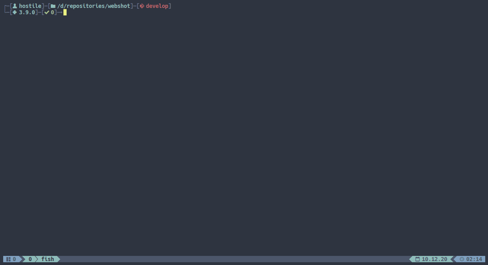
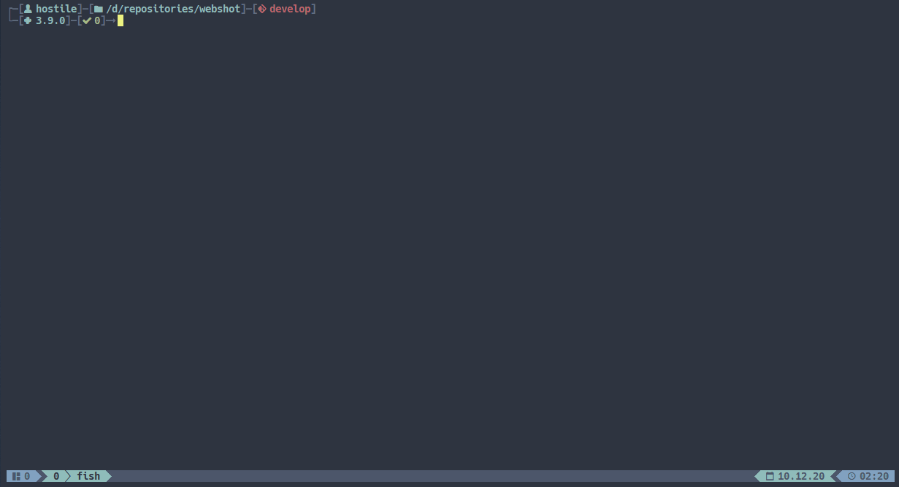

# WebShot

A python/selenium-based recon and information gathering tool. WebShot takes a list of domains passed as an
stdin and then probes each one of them to collect response data and take a website screenshot. At the end, it
generates an html report with all collected data.

## Requirements

Requires Python version `>=3.5.0`

## Setup

```bash
$ git clone https://github.com/hostilex00/webshot.git
$ cd webshot
$ pip install .
```



## Usage
Run `webshot --help` for help and usage:
```bash
$ webshot --help
     __          __  _     _____ _           _
     \ \        / / | |   / ____| |         | |
      \ \  /\  / /__| |__| (___ | |__   ___ | |_
       \ \/  \/ / _ \ '_  \___ \| '_ \ / _ \| __|
        \  /\  /  __/ |_) |___) | | | | (_) | |_
         \/  \/ \___|_.__/_____/|_| |_|\___/ \__|

        ver 0.1.0

usage: webshot [-h] [-v] [-o OUTPUT] [-t THREADS]

optional arguments:
  -h, --help            show this help message and exit
  -v, --version         show program's version number and exit
  -o OUTPUT, --output OUTPUT
                        output directory
  -t THREADS, --threads THREADS
                        number of threads
```

To run `webshot` simply cat file with list of urls and pass it to webshot as stdin:

```bash
$ cat urls.txt | webshot -t 5 -o ./my_webshot_report/
```

